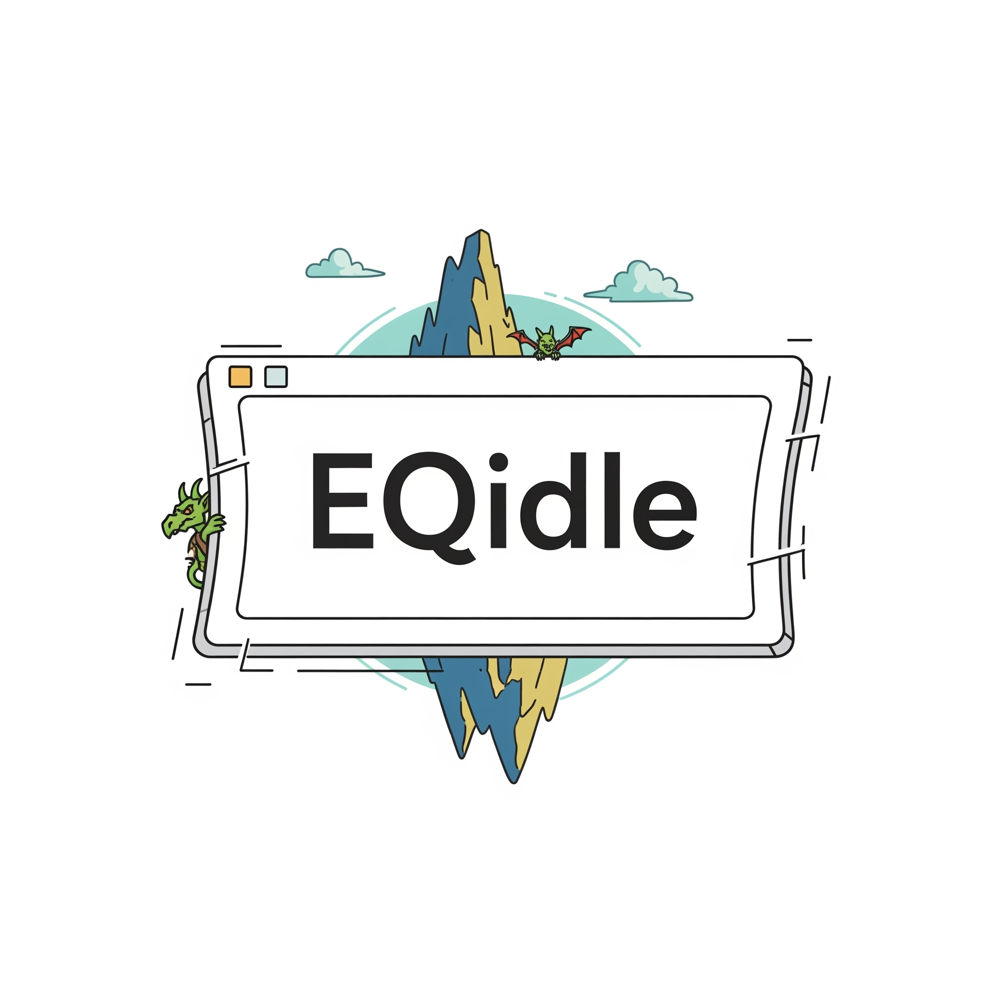

# EQidle: Your Quest for the Perfect UI, No Manual XML Grinding Required.

## ✨ The Proclamation ✨

Welcome, weary traveler, to the Git repository of **EQidle**! Have you ever stared longingly at your EverQuest UI, wishing for just a *little* less... "ancient parchment chic" and a *little* more "functional masterpiece"? Have you spent countless hours manually tweaking XML, only to accidentally turn your hotbar into a sentient, invisible cube?

Fear not! For **EQidle** is here to banish the nightmares of misplaced `<ScreenID>` tags and errant `X` coordinates. Our quest? To build a visual, intuitive, and gloriously un-hieroglyphic EverQuest User Interface editor. No more squinting at Notepad++. Well, you'll still use Notepad++, but for your *code*, not for EQ's UI files! (Unless you want to. We don't judge.)

## 📜 Our Sacred Scroll (The Vision) 📜

**EQidle** aims to be the ultimate companion for Norrath's most discerning pixel-pushers. Imagine:
* **Drag-and-Drop Divinity:** Visually position, resize, and configure your UI elements with the satisfying click of a mouse, not the soul-crushing precision of integer values.
* **Instant Enlightenment:** See your changes in real-time, right there in the editor, before you even dare to `/loadskin`.
* **XML Whispering:** Beneath the hood, EQidle will gracefully translate your divine designs into perfectly valid EverQuest UI XML, complete with proper element types, attributes, and (hopefully) no accidental portal spells.
* **Cross-Client Harmony:** Built with a keen eye on `SIDL.xml` from the live client, aiming for broad compatibility across various EverQuest eras (yes, even that ancient RoF2 client you keep around).
* **Sanity Preservation:** Our primary goal is to prevent the onset of "UI-induced madness" – a debilitating condition common among hand-modding adventurers.

## 🛠️ The Smithy (Current Status) 🛠️

We're currently in the very, *very* early stages of forging this artifact. Right now, we're deep in the academic archives (read: `SIDL.xml`), deciphering the ancient runes (read: XML schema) that govern EverQuest's interface.

**Current Focus:**
* **XML Archaeology:** Understanding every `ElementType`, `element`, `superType`, and mysterious `EQType` attribute.
* **Linguistic Translation:** Building the core logic to parse EverQuest UI XML files into intelligent Python objects, and then translate those objects back into perfectly formatted XML. This is the engine. The pixel-pushing visual stuff comes *after* the engine purrs like a contented gruffling.

**What you *won't* see yet:**
* A pretty graphical interface (unless you count your Python console's output).
* Drag-and-drop functionality (we're still teaching our digital hands to wield the mouse).
* Flashing spell effects (unless you accidentally trigger a syntax error).

## 🧙‍♂️ Our Mystical Tools (Tech Stack) 🧙‍♀️

* **The Tongue of the Gods:** Python (specifically, 3.x)
* **The Arcane Scroll of Visual Arts:** PyQt6 (because crafting beautiful interfaces for *our* interface is meta-level magic).
* **The Scribe's Quill:** Notepad++ (for pure, unadulterated code-slinging and XML deciphering).
* **The Chronicler's Tome:** Git (for remembering every single step of this glorious journey, and preventing accidental deletion of the entire project due to a rogue Guktan).
* **The Cartographer's Gaze:** GIMP / Paint.NET (for dissecting those enigmatic `.tga` texture files).

## 📣 Join the Guild (Contributing) 📣

While this project is currently in its nascent, highly experimental phase (and likely private for now), the spirit of collaborative adventuring is always welcome!

* **For now:** Cheer us on! Send good vibes into the ether! Think positive thoughts about well-formed XML!
* **Later:** We'll outline how valiant developers can contribute code, ideas, or even just bug reports (when we inevitably summon some).

## 📜 The Fine Print (License) 📜

This project is released under the [MIT License](LICENSE.md). Go forth and customize, adventurer!

---

*Because life is too short for misaligned UI elements.*

**Happy Questing!**
The EQidle Development Team
